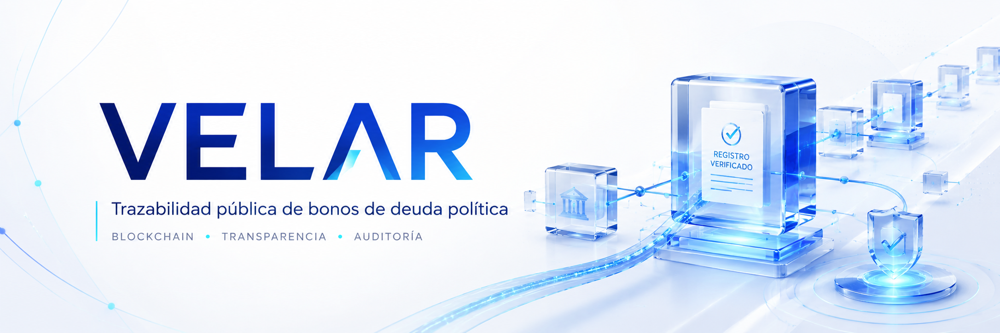

# VELAR

**Infraestructura blockchain para el traspaso digital de propiedad de bonos de partidos políticos.**

> Trazabilidad, custodia y auditoría en tiempo real sobre Stellar : para el TSE, partidos y ciudadanos.

[](https://railway.com/template)

---

## Stack tecnológico

<div align="center">


</div>

---

## ¿Qué es VELAR?

Hoy los bonos de partidos políticos se traspasan en papel: sin control de quién es el dueño, sin historial verificable, sin trazabilidad para el TSE. **VELAR lo digitaliza.**

Cada bono es un **token único en la blockchain de Stellar** (análogo a un NFT institucional). La propiedad, el escrow durante el traspaso y todo el historial de cambios de dueño viven on-chain : verificables por cualquier persona, en tiempo real.

---

## Las tres perspectivas

| Actor | Rol | Capacidades |
|---|---|---|
| 🏛️ **TSE** | Autoridad fiscalizadora | Emite bonos, supervisa todos los traspasos, audita historial, puede congelar |
| 🎗️ **Partido** | Emisor / Vendedor | Recibe bonos emitidos, los pone en venta, confirma pagos |
| 👤 **Usuario** | Comprador / Recomprador | Compra bonos al partido o a otros usuarios, revende |

---

## El flujo completo

```
1. TSE emite el bono  ────────────────►  a nombre de un PARTIDO  (token minteado en Stellar)
2. El PARTIDO pone el bono en venta
3. Un USUARIO solicita comprarlo
4. El dueño ACEPTA  ──────────────────►  el token entra a ESCROW (bloqueado on-chain) 🔒
5. El comprador registra el PAGO (hash del comprobante físico)
6. El vendedor CONFIRMA el pago  ──────►  el token pasa al nuevo dueño 🎉
```

Cada paso queda como una **transacción inmutable en Stellar**, auditable en [`stellar.expert`](https://stellar.expert/explorer/testnet).

---

## Arquitectura del monorepo

```
VELAR/
├── apps/
│   ├── api/          # NestJS : lógica de negocio + integración Stellar/Soroban
│   └── web/          # Next.js : UI para TSE, partidos y usuarios
├── contracts/
│   └── velar-bond/   # Contrato Soroban en Rust (metadata on-chain por bono)
├── packages/
│   └── types/        # Tipos TypeScript compartidos
├── supabase/
│   └── migrations/   # Esquema de base de datos
└── docs/             # Documentación técnica detallada
```

---

## Cómo los bonos viven en blockchain

- Cada bono es un **Classic Asset de Stellar** (cantidad `1`, no divisible) : único por diseño, como un NFT pero sin gas fees prohibitivos.
- **Opcionalmente**, cada bono tiene un **contrato Soroban** individual con toda su metadata on-chain (monto, fechas, certificado, partido, estado).
- **"Ser dueño del bono" = tener ese token en una cuenta de Stellar.** No hay base de datos que lo diga: la blockchain es la fuente de verdad.
- Cada actor tiene una **wallet de custodia** creada y administrada por el backend : el usuario nunca maneja llaves privadas ni crypto.
- El **escrow** es una cuenta Stellar separada donde el token queda bloqueado (multisig) durante el proceso de traspaso.
- El **pago es externo** (fiat / físico): solo se registra el hash SHA-256 de su comprobante.

---

## Cómo correrlo

```bash
# 1. Instalar dependencias
npm install

# 2. Configurar variables de entorno
cp apps/api/.env.example apps/api/.env
# Editar con tus claves de Supabase

# 3. Crear wallets de custodia en testnet
cd apps/api
npm run provision:wallets

# 4. Sembrar datos de demo
npm run seed

# 5. Levantar la API
npm run start        #  a  http://localhost:3001/api

# 6. Levantar el frontend (en otra terminal)
cd ../web
npm run dev          #  a  http://localhost:3000
```

### Probar sin frontend

El backend sirve una **consola web** con flujo de un clic:

```
http://localhost:3001/api/console
```

O por terminal:

```bash
npm run demo:flow         # flujo completo con cuentas sembradas
npm run demo:register     # registra partido + usuario nuevos y corre el flujo
```

---

## Endpoints principales (prefijo `/api`)

### Auth y entidades

| Método | Ruta | Descripción |
|---|---|---|
| `POST` | `/auth/register` | Registro (rol `usuario` o `partido`), crea wallet Stellar automáticamente |
| `GET` | `/users/me` | Perfil propio |
| `GET` | `/parties` | Lista de partidos |

### Bonos

| Método | Ruta | Descripción |
|---|---|---|
| `GET` | `/bonds` | Bonos según rol (TSE ve todo, partido ve los suyos, comprador los que posee) |
| `GET` | `/bonds/available` | Bonos en venta para comprar (`status = en_venta`) |
| `POST` | `/bonds` | Emitir bono directamente (TSE) |
| `GET` | `/bonds/requests` | Solicitudes de emisión |
| `POST` | `/bonds/requests` | Partido solicita un bono al TSE |
| `PATCH` | `/bonds/requests/:id/approve` | TSE aprueba  a  emite Classic Asset + despliega Soroban NFT |
| `PATCH` | `/bonds/requests/:id/reject` | TSE rechaza con motivo |
| `PATCH` | `/bonds/:tokenId/publish` | Dueño actual publica al marketplace |
| `PATCH` | `/bonds/:tokenId/freeze` / `/unfreeze` | TSE congela / descongela |
| `GET` | `/bonds/:tokenId/onchain` | Info on-chain del bono |

### Transferencias / marketplace

| Método | Ruta | Descripción |
|---|---|---|
| `POST` | `/transfers` | Solicitar compra (con monto custom para ofertas) |
| `PATCH` | `/transfers/:id/accept` | Vendedor acepta  a  token a escrow + Trustless Work deploy |
| `PATCH` | `/transfers/:id/counter` | Vendedor contraoferta con nuevo monto |
| `PATCH` | `/transfers/:id/accept-counter` | Comprador acepta contraoferta |
| `PATCH` | `/transfers/:id/payment` | Comprador registra pago (con hash de evidencia) |
| `PATCH` | `/transfers/:id/validate` | Validador confirma pago físico |
| `PATCH` | `/transfers/:id/release` | Vendedor libera  a  token al comprador + VCRC al vendedor (atómico) |
| `PATCH` | `/transfers/:id/cancel` | Cancelar transferencia |
| `PATCH` | `/transfers/:id/request-return` | Dueño pide al TSE retirar bono del escrow |
| `PATCH` | `/transfers/:id/approve-return` | TSE aprueba retorno on-chain |
| `PATCH` | `/transfers/:id/reject-return` | TSE rechaza solicitud de retorno |

### Análisis (TSE)

| Método | Ruta | Descripción |
|---|---|---|
| `GET` | `/analytics/overview` | Métricas generales |
| `GET` | `/analytics/by-party` | Volumen y bonos por partido |
| `GET` | `/analytics/bonds/:tokenId/price-history` | Histórico de precios con % de cambio |
| `GET` | `/analytics/bonds/:tokenId/owners` | Cadena de propietarios |
| `GET` | `/analytics/top-bonds` | Top N bonos por volumen |
| `GET` | `/analytics/volume-over-time` | Serie temporal de volumen |

### Reportes del partido al TSE

| Método | Ruta | Descripción |
|---|---|---|
| `POST` | `/reports` | Partido envía reporte |
| `GET` | `/reports` | TSE lista todos / Partido lista los suyos |
| `PATCH` | `/reports/:id/review` | TSE marca como `revisado / observado / aprobado` |

### 🌐 Endpoint público (sin auth)

| Método | Ruta | Descripción |
|---|---|---|
| `GET` | `/explorer/snapshot` | Estado completo on-chain: cuentas, assets, contratos Soroban, bonos recientes, glosario de memos. Cualquiera puede consumirlo sin login. |

---

## Páginas del frontend

### Públicas (sin login)

| Ruta | Para qué |
|---|---|
| `/` | Landing con hero, proceso, historial, FAQ, CTA |
| `/explorer` | Ledger público con todos los enlaces a stellar.expert |
| `/login` (alias `/entrar`) | Iniciar sesión |
| `/signup` | Crear cuenta |

### TSE

| Ruta | Para qué |
|---|---|
| `/tse` | Dashboard con métricas y acciones rápidas |
| `/tse/revision` | Solicitudes pendientes con filtros y aprobar/rechazar |
| `/tse/registros` | Todos los bonos con chip 🪙 NFT si tienen Soroban contract |
| `/tse/trazabilidad` | Timeline de propietarios por bono |
| `/tse/escrows` | Tabs: Todas / En canasta / Cerradas + filtro por estado |
| `/tse/retiros` | Aprobar o rechazar solicitudes de retiro del escrow |
| `/tse/analytics` | Gráficas de volumen por partido + precios + dueños |
| `/tse/reportes` | Reportes enviados por partidos (modal con totales + bonos + Stellar) |
| `/tse/emision` | Emitir bono directo (sin solicitud previa) |
| `/tse/auditoria` | Eventos del sistema |

### Partido

| Ruta | Para qué |
|---|---|
| `/partido` | Dashboard del partido |
| `/partido/solicitar-bonos` | Formulario para pedir bono al TSE |
| `/partido/mis-bonos` | Bonos del partido con botón "Publicar" |
| `/partido/negociaciones` | Solicitudes de compra recibidas |
| `/partido/trazabilidad` | Trazabilidad de sus bonos |
| `/partido/reportes` | Enviar reportes al TSE |
| `/partido/configuracion` | Wallet Stellar del partido con link al explorador |

### Usuario / comprador

| Ruta | Para qué |
|---|---|
| `/marketplace` | Bonos disponibles con input para oferta custom |
| `/mis-bonos` | Bonos del usuario con botón "Publicar" para revender |
| `/negociaciones` | Sus negociaciones con chip 🛡 Trustless Work |
| `/trazabilidad` | Trazabilidad de sus bonos |

---

## Documentación

| Documento | Contenido |
|---|---|
| [`docs/WEB3.md`](docs/WEB3.md) | Conceptos Web3 aplicados: Stellar, Soroban, escrow, wallets, tokens, Trustless Work |
| [`docs/SOROBAN.md`](docs/SOROBAN.md) | Contrato `VelarBond`: arquitectura, cómo activarlo, funciones |
| [`docs/DEPLOY.md`](docs/DEPLOY.md) | Deploy en Railway : pasos, variables de entorno, troubleshooting |
| [`docs/DEMO.md`](docs/DEMO.md) | Cómo levantar, probar y ver el token moverse |
| [`docs/BACKEND.md`](docs/BACKEND.md) | Arquitectura y módulos del backend |
| [`docs/FRONTEND_GUIDE.md`](docs/FRONTEND_GUIDE.md) | Contrato de API para el equipo de frontend |
| [`docs/AGENTS.md`](docs/AGENTS.md) | Reglas para agentes de IA que trabajen en el repo |
| [`ROADMAP.md`](ROADMAP.md) | Estado, backlog y próximos niveles Web3 |

---

## Composición del sistema (aprox.)

```
Frontend Next.js (UI / shells / formularios)   ~63%
Backend NestJS web2 (auth, queries, analytics) ~10%
Backend mixto (bonds + transfers + Stellar)    ~12%
Stellar SDK + Soroban + Trustless Work         ~6%
Schema SQL + tipos compartidos                 ~9%
```

**De 52 endpoints HTTP, 14 tocan blockchain (27%).** El resto es BD pura.

---

> Testnet / demo. Las wallets son de custodia sin dinero real. No usar en producción sin auditoría de seguridad.
